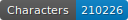
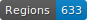
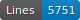
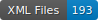

# HTR data for 19th Century Speculative Fiction from Peru and Argentina

   

# Data

ALTO files with segmentation and transcription fully corrected manually.

## Licence

Transcriptions are open source, not the images which belong to the library.

## Citation

Carmen Carrasco Luján, _data for 19th Century Speculative Fiction from Peru and Argentina_, University of Geneva, 2024

